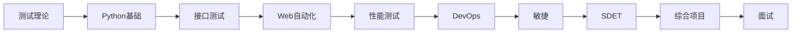
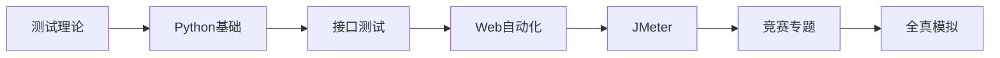

# 软件测试学习笔记

> 基于 Obsidian Vault 的软件测试完整学习体系

## 学习路径

### 就业方向

### 竞赛方向

## 模块索引

| 模块 | 内容 | 状态 |
|------|------|------|
| [[01-测试理论/index\|测试理论]] | 测试概念、用例设计、缺陷管理、Linux、SQL | 🚧 |
| [[02-编程基础/index\|编程基础]] | Python 语法、数据结构、常用库 | ⏳ |
| [[03-接口测试/index\|接口测试]] | HTTP、Postman、requests、接口自动化 | ⏳ |
| [[04-Web自动化/index\|Web自动化]] | Selenium、Playwright、Pytest、PO | ⏳ |
| [[05-移动端测试/index\|移动端测试]] | ADB、Appium | ⏳ |
| [[06-性能测试/index\|性能测试]] | JMeter、Locust、性能监控 | ⏳ |
| [[07-安全测试/index\|安全测试]] | OWASP、安全工具 | ⏳ |
| [[08-DevOps/index\|DevOps]] | Git、GitHub Actions、Docker | ⏳ |
| [[09-敏捷与项目管理/index\|敏捷]] | Scrum、JIRA、质量度量 | ⏳ |
| [[10-SDET/index\|SDET]] | 设计模式、框架开发、代码质量 | ⏳ |
| [[11-云测试/index\|云测试]] | AWS/Azure、云原生测试 | ⏳ |
| [[12-AI测试/index\|AI测试]] | AI生成用例、大模型测试 | ⏳ |
| [[13-面试与职业/index\|面试]] | 面试题、简历包装 | ⏳ |
| [[14-竞赛专题/index\|竞赛]] | GZ034 专项训练 | ⏳ |

## 使用方式

1. 按顺序学习，每节包含：**核心概念** → **动手实操** → **自测清单**
2. 代码实操在 `labs/` 仓库中，克隆到本地运行
3. 判断对错：自测清单 + [[90-参考答案/index|参考答案]] + 自动化验证
4. 延伸阅读链接在每节末尾，按需深入

## 外链资源

完整外链索引：[[99-资源索引]]

---

> [!tip] 学习建议
> - 每节自测清单全部打勾后再进入下一节
> - 代码类实操必须亲手运行，不要只读
> - 综合项目是检验学习成果的关键
